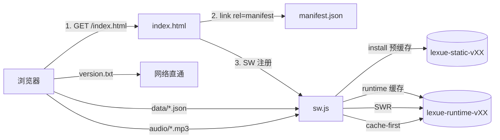

## 用户要求

继续乐学英语（原 happyenglish）项目的开发。该项目的开发关键记录已沉淀在仓库根目录的 `PROJECT_STATUS.md` 中，无需额外迁移。本轮任务是：

1. 基于磁盘事实校准 `PROJECT_STATUS.md`，消除与实际进度的偏差，让下一次接手的人/AI 不再走重复路。
2. 把工作区未跟踪的 PWA 初稿（`icon.svg` / `manifest.json`）纳入开发，完成 PWA 离线可用闭环（对应路线图 v01.19 提前做）。

## 产品概述

乐学英语是面向 1-9 年级学生的纯静态英语学习 Web 应用（GitHub Pages 部署）。核心能力：单词/课文学习、4 类题型练习、真人级 TTS 朗读、全局年级/学期/教材切换。本轮不改核心功能，只做「文档校准 + PWA 收尾」。

## 核心功能

- **文档校准**：用磁盘实际数据刷新 `PROJECT_STATUS.md` §3 规模表、§7 Git log 摘要、§8 v01.10 checkbox，并更新 HEAD 引用与日期。
- **PWA 可安装**：在 `index.html` 注入 `<link rel="manifest">` 与 iOS 图标 meta，补齐 `icon-192.png` / `icon-512.png`，让 Chrome / Safari 菜单出现"添加到主屏幕"。
- **离线可用**：新增 `sw.js`，对 HTML/CSS/JS/manifest/图标 做预缓存，对 `data/*.json` 走 stale-while-revalidate，对 `audio/*.mp3` 走 cache-first，`data` 与 `audio` 走运行时缓存，激活时清理旧版本缓存。
- **与现有缓存破坏机制兼容**：Service Worker 缓存命名使用 `version.txt` 首行（与 `__APP_VERSION` 一致），确保推送新版本后下次打开自动升级。
- **README 同步**：把「PWA 离线可用」勾到开发进度。

## 技术栈

沿用现有栈，零新增依赖：

- 前端：原生 HTML / Tailwind CDN / ES6 JS（不引入构建）
- PWA：浏览器原生 `manifest.json` + Service Worker API（`sw.js`）
- 图标生成：优先 Python `cairosvg + Pillow`（若本机已装可直接跑）；失败则提供备用脚本由用户运行，不阻塞主线
- 文档：Markdown 纯文本更新

## 实现方案

### 线 A：PROJECT_STATUS.md 校准（零风险）

基于体检拿到的磁盘事实逐行对齐：

- §3 题库规模：jk 合计 420（spelling 224 / listening 52 / grammar 72 / reading 72）；hj 合计 255（spelling 95 / listening 32 / grammar 80 / reading 48）；音频 303 个
- §3 去掉「grade9B_u5_L0 缺 1 待补」（已补齐）
- §7 追加 5 个新 commit：`b5dae7f / f8634b6 / dde6cdc / c66e3e7 / d91e3d6`，更新 HEAD 引用为 `d91e3d6`
- §8 v01.10 四个 checkbox 全部勾上（hj_*.json 都已存在且有内容、`questionBank.js` 已按 `{tb}_{type}.json` 路由）
- 文末更新日期与简短交接语

### 线 B：PWA 收尾

#### B1. index.html 注入（最小侵入）

在 `<head>` 现有 meta 后、`<script>` 之前插入两行：

```html
<link rel="manifest" href="./manifest.json">
<link rel="apple-touch-icon" href="./icon-192.png">
```

在 body 末尾现有 `addScript(...).then(...)` 链最后追加一步 SW 注册：

```html
<script>
  if ('serviceWorker' in navigator) {
    window.addEventListener('load', function(){
      navigator.serviceWorker.register('./sw.js').catch(function(e){ console.warn('[SW] 注册失败', e); });
    });
  }
</script>
```

**严禁破坏现有机制**：`__APP_VERSION` / `__withVer` / 按序 addScript 不得动；SW 注册放 load 事件后异步做，失败只 warn 不抛错。

#### B2. sw.js 缓存策略

启动时读 `version.txt?_=timestamp` 首行作为 `CACHE_VERSION`，派生两套缓存名：

- `lexue-static-v<version>`：预缓存核心静态（index/styles/app/3 个 js 模块/questionBank/manifest/icon.svg/两张 PNG）
- `lexue-runtime-v<version>`：运行时缓存（data JSON、audio MP3）

fetch 策略：

- 请求路径含 `/data/` 且以 `.json` 结尾 → stale-while-revalidate（返 cache，后台更新）
- 请求路径含 `/audio/` 且以 `.mp3` 结尾 → cache-first（命中即返，失败 fetch 并写缓存）
- 其它同源 GET → network-first，fallback 预缓存
- 跳过 `version.txt`（必须 no-store，永远走网络）
- 跳过非 GET、非同源（Tailwind / Chart.js CDN 本身带 long-cache，不拦截）

activate 时清理所有不等于当前 version 的旧缓存桶，防止磁盘膨胀。
install 时 `self.skipWaiting()`，activate 时 `self.clients.claim()`，保证下次访问立即生效。

#### B3. 图标生成

从 `icon.svg` 生成 `icon-192.png` / `icon-512.png`（maskable 安全区已在 SVG 内预留）：

- 优先执行 `py -3 -c "import cairosvg; cairosvg.svg2png(..., output_width=512)"`（用 pipe 生成两张）
- 若 cairosvg 不可用，退化为 Pillow + svglib；仍失败则在 `scripts/gen_pwa_icons.py` 留一个独立脚本，用户下次自己装 deps 再跑
- 优先级低：即便图标没生成，manifest 也能正常加载（icon.svg 已够），不阻塞离线可用

### 实现注意事项

#### 性能

- SW 预缓存清单保持小（< 20 项），只放"首屏关键路径"文件；大文件（mp3、textbook json）全部走运行时缓存，避免首次安装卡 10 秒+
- `data/*.json` 用 stale-while-revalidate 而非 cache-first：题库更新后用户下次打开不用等（先用旧的，后台同步新的）
- `audio/*.mp3` 用 cache-first：一旦下载永久命中，省流量且离线可播（MP3 体量大，是 PWA 离线的最大收益）
- 不对第三方 CDN（Tailwind / Chart.js）做拦截，免去 CORS 与缓存控制冲突

#### 日志

- SW 内只在 install / activate / 缓存清理 3 个时机 `console.log`，fetch 循环内不打日志（否则 DevTools 爆屏）
- 注册失败走 `console.warn`，不 throw，不影响主 app

#### 爆炸半径控制

- SW 用独立 `CACHE_VERSION` 与现有 `__APP_VERSION` 对齐但各自独立，SW 失败不影响主 app（所有 SW 相关代码都在 `if ('serviceWorker' in navigator)` 守卫内）
- manifest / icons 走相对路径（`./`），与现有 GitHub Pages 部署子路径兼容
- 保留 `icon.svg` 作为 manifest icons 第一项兜底，即使 PNG 未生成，Android / 新 iOS 仍可用 SVG

## 架构



## 目录结构

```
english-tutor/
├── PROJECT_STATUS.md         # [MODIFY] §3 规模表/§7 Git log/§8 v01.10 checkbox/末尾日期对齐磁盘事实，去掉"grade9B_u5_L0 缺 1 待补"
├── README.md                 # [MODIFY] 开发进度新增一条已完成项「PWA 离线可用」
├── index.html                # [MODIFY] head 内注入 <link rel="manifest"> 与 apple-touch-icon；body 末尾 addScript 链条后追加一段 SW 注册脚本（守卫在 'serviceWorker' in navigator 内）
├── manifest.json             # [KEEP] 已就绪，不改
├── icon.svg                  # [KEEP] 已就绪，作为 SVG 图标与 PNG 生成源
├── icon-192.png              # [NEW] 由 icon.svg 生成（192×192，maskable any），供 Android 主屏与 apple-touch-icon 使用
├── icon-512.png              # [NEW] 由 icon.svg 生成（512×512，maskable any），供高分屏与安装启动画面使用
├── sw.js                     # [NEW] Service Worker。CACHE_VERSION 读 version.txt 首行；install 预缓存核心静态；fetch 对 data/*.json 走 SWR、audio/*.mp3 走 cache-first、其它走 network-first；activate 清理旧桶 + clients.claim()
└── scripts/
    └── gen_pwa_icons.py      # [NEW] 备用：用 cairosvg/Pillow 从 icon.svg 生成两张 PNG，命令行：py -3 scripts/gen_pwa_icons.py
```

## 关键代码结构（sw.js 骨架，仅接口级）

```js
// sw.js - 伪代码骨架
const STATIC_ASSETS = [
  './', './index.html', './styles.css', './app.js',
  './questionBank.js',
  './js/textbook.js', './js/state.js', './js/player.js',
  './manifest.json', './icon.svg', './icon-192.png', './icon-512.png'
];
// 运行时由 version.txt 决定 CACHE_VERSION
// self.addEventListener('install', e => { e.waitUntil(precache()); self.skipWaiting(); });
// self.addEventListener('activate', e => { e.waitUntil(cleanOldCaches()); self.clients.claim(); });
// self.addEventListener('fetch', e => { route(e) }); // 根据 pathname 派发 SWR / cache-first / network-first
```

## Agent Extensions

### SubAgent

- **code-explorer**
- 用途：若后续新增 PWA 功能（错题本 / 多用户档案等）需要跨文件搜索 `state` 对象使用点 / `localStorage` 调用点 / `applyContextChange` 的调用链时，用它集中摸清影响面
- 预期产出：本轮 PWA 收尾不必调用（体检阶段已掌握所有上下文）；作为后续里程碑（v01.16 错题本起）的标准入口保留