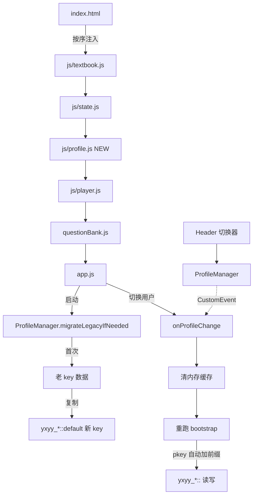

## 产品概述

本轮任务分两条并行线，一次性交付：

1. **v01.14 上线收尾**：把已完成的 PWA 收尾（manifest + sw.js + index.html 注入 + 状态校准）推上 GitHub Pages，并在仓库里提前生成两张真二进制 PNG 图标（不再依赖用户本机装 cairosvg），保证 iOS 16 以下的机器加到主屏也有正经图标。
2. **v01.20 多用户本地档案**：为家里两个孩子（及未来更多学习者）引入独立的学习档案——每个 profile 有独立的学习上下文（年级/学期/教材）、错题本、统计（🔥 天数/累计分钟/掌握单词/得分）。顶部右上角新增 profile 切换按钮 + 下拉菜单（新建/编辑/删除），删除时二次确认。首次升级的老用户数据无损搬运到 "默认" profile。

## 核心功能

### v01.14 手机上线

- 用 Python 标准库（zlib+struct）在仓库根目录生成 `icon-192.png` / `icon-512.png`（蓝紫渐变圆角方块 + 白色 "乐" 字，与 icon.svg 主视觉一致）
- 执行 `dev-push.ps1` 推送所有待推文件（自动 bump 到 v01.14），GitHub Pages ~1 分钟后上线
- 手机访问线上地址，验证：可 "加到主屏"、图标正确、离线可背单词

### v01.20 多用户本地档案

- **Profile 数据模型**：`yxyy_profiles_v1` = `[{id,name,avatar,color,createdAt}]`，`yxyy_active_profile_v1` = pid
- **持久化按 profile 隔离**：6 个入口函数（`_loadWrongbook/_saveWrongbook/_loadStats/_saveStats/loadCtx/saveCtx`）内部自动拼接 profile 前缀，存取变成 `yxyy_wrongbook_v1::<pid>` / `yxyy_stats_v1::<pid>` / `yxyy_ctx::<pid>`
- **首次升级迁移**：检测到老 key 存在 + 无 profile 配置时，自动创建 "默认" profile（id=default）并把老数据搬入新 key，写 `yxyy_migrated_v1=1` 防重复
- **顶部切换器 UI**：header 右侧 🔥 徽标左边加 "👤 小明 ▾" 按钮，点击弹出下拉：Profile 列表（每项显示头像+名字+当前 ✓）、➕ 新建、✏️ 编辑当前、🗑️ 删除当前（至少保留 1 个，弹二次确认）
- **新建 / 编辑 Profile 对话框**：头像（emoji 或单字）、名字、主题色选择
- **切换后行为**：清内存缓存（`_stats` / `_wrongbook`）→ 重新跑 bootstrap（`loadCtx → loadTextbook → loadQuestionBank → applyContextChange → renderHomeStats`）→ toast 提示 "已切换到 XXX"
- **记住选择**：`yxyy_active_profile_v1` 持久化，刷新浏览器后自动恢复

## 视觉效果

- Header 右上从当前 `[🔥 0 天]` 变成 `[👤 小明 ▾] [🔥 0 天]`，头像圆角方块使用 profile 自选主题色渐变，和现有 UI 风格一致（Tailwind 圆角+阴影）
- 下拉菜单采用卡片风格（白底/阴影/圆角），每个 profile 项 hover 蓝紫淡色，当前项右侧 ✓
- 新建/编辑弹框居中覆盖层，深色背景半透明遮罩；头像选择器提供 6 个 emoji 快捷（👦👧🧒🐱🐰🐼）+ 自定义单字输入；主题色提供 6 个预设（蓝/紫/粉/橙/绿/青）

## 技术栈

延续现有栈，零新增运行时依赖：

- 前端：原生 HTML / Tailwind CDN / ES6 JS（无构建）
- 存储：localStorage（全部改造集中在 `app.js`）
- 图标生成：Python 3 标准库 `zlib + struct`（手写最小 PNG）——不需要 Pillow/cairosvg
- 部署：`dev-push.ps1` → GitHub Pages（main 分支根目录）

## 实现方案

### 线 A：v01.14 手机上线

#### A1. 生成真二进制 PNG 图标

写一个一次性 Python 脚本 `scripts/gen_pwa_icons_raw.py`，用标准库生成 `icon-192.png` / `icon-512.png`：

核心算法：

- 先在内存里构造 RGBA 像素矩阵（W*H*4 字节）
- 画蓝紫对角渐变背景（#3b82f6 → #8b5cf6），圆角方块 mask（半径 = 尺寸 * 96/512 = 18.75%）
- 中心画一个白色简化 "乐" 字（用 11x11 点阵存字形，放大 N 倍；大小约占尺寸 45%）
- 写最小 PNG：`\x89PNG\r\n\x1a\n` header + IHDR + IDAT（zlib 压缩 scanline, filter=0） + IEND
- CRC32 用 `binascii.crc32`

优点：零依赖，Python 3.3+ 开箱即用；生成的 PNG 是合法二进制文件，浏览器原生支持。

#### A2. 推送

执行 `powershell -ExecutionPolicy Bypass -File .\dev-push.ps1 "feat(pwa): v01.14 PWA 收尾 + 多用户档案收尾/打底"` 走脚本的完整流程：

- 自动 commit 所有 modified + untracked 文件
- 自动 bump version.txt 到 `20260505V01.14`
- push 到 origin/main

#### A3. 手机测试验证清单

- Android Chrome：菜单 → "添加到主屏幕"，图标为蓝紫 "乐" 方块
- iOS Safari：分享 → "添加到主屏幕"
- 飞行模式 / 断网后重开 PWA：能加载首页、切年级、背单词（走 SW 的 cache-first for audio + SWR for data）
- Chrome DevTools Application 面板：Manifest 绿勾、Service Worker activated

### 线 B：v01.20 多用户本地档案

#### B1. Profile 存储层（新增 `js/profile.js`）

新建独立模块 `js/profile.js`（遵循现有 `js/textbook.js / state.js / player.js` 的"全局变量"风格，不引 ES Module），挂载到 `window.ProfileManager`：

```js
// 接口级定义（不写实现）
window.ProfileManager = {
  // key 生成：统一加 profile 前缀
  pkey(baseKey, pid = ProfileManager.active()) { /* 返回 `${baseKey}::${pid}` */ },

  // 数据层
  list(),                // 读 yxyy_profiles_v1 → [{id,name,avatar,color,createdAt}]
  active(),              // 读 yxyy_active_profile_v1 → pid (保证至少返回 'default')
  setActive(pid),        // 写入 + 触发 'profile:changed' CustomEvent
  create({name,avatar,color}),  // 新增 profile，返回 pid
  update(pid, patch),
  remove(pid),           // 同时清掉该 profile 的所有 ::pid 数据

  // 首次升级迁移（幂等）
  migrateLegacyIfNeeded(),

  // UI 事件（由 app.js 监听）
  onChange(handler)
};
```

加载顺序：`index.html` 动态注入链在 `state.js` 之后、`player.js` 之前加 `profile.js`：

```
textbook.js → state.js → profile.js → player.js → questionBank.js → app.js
```

#### B2. 改造 `app.js` 的 6 个持久化入口（最小侵入）

只改 6 个函数内部的 `localStorage.getItem/setItem/removeItem` 的 key：

```js
// 改造前
localStorage.getItem('yxyy_wrongbook_v1')
// 改造后
localStorage.getItem(window.ProfileManager.pkey('yxyy_wrongbook_v1'))
```

涉及位置（探索阶段已确认）：

- `app.js:77-98` _loadWrongbook / _saveWrongbook
- `app.js:263-291` _loadStats / _saveStats  
- `app.js:1036-1050` loadCtx / saveCtx

其他业务代码 **零改动**（答题、切年级、记录学习时长都走这 6 个函数）。

#### B3. 首次升级数据搬运

`ProfileManager.migrateLegacyIfNeeded()` 逻辑：

1. 读 `yxyy_migrated_v1`，若 = "1" 直接返回
2. 读 3 个老 key：`yxyy_wrongbook_v1` / `yxyy_stats_v1` / `yxyy_ctx`
3. 如果有任何一个存在，创建 default profile（`{id:'default',name:'默认',avatar:'默',color:'blue'}`）
4. 老数据复制到 `yxyy_wrongbook_v1::default` / `yxyy_stats_v1::default` / `yxyy_ctx::default`（保留老 key 做兜底，不删）
5. 写 `yxyy_migrated_v1 = "1"` + `yxyy_active_profile_v1 = "default"`

这一步必须在 `bootstrap()` 的 `loadCtx()` 之前执行，即：

```js
(async function bootstrap() {
  window.ProfileManager.migrateLegacyIfNeeded();  // ← 新增
  loadCtx();  // 内部已经按 pkey 读新 key
  ...
})();
```

#### B4. UI：顶部切换器 + 弹框（`index.html` + `app.js` 追加段）

**Header 改造**（`index.html:75-82` 定位）：在 🔥 徽标 **左侧** 插入：

```html
<button id="profileSwitcher" class="flex items-center gap-2 px-2.5 py-1.5 rounded-full bg-slate-50 border border-slate-200 hover:bg-slate-100 active:scale-95 transition" title="切换学习者">
  <span id="profileAvatar" class="w-7 h-7 rounded-full bg-gradient-to-br from-blue-500 to-indigo-500 flex items-center justify-center text-white text-sm font-bold">明</span>
  <span id="profileName" class="text-sm font-semibold text-slate-700">小明</span>
  <span class="text-xs text-slate-400">▾</span>
</button>
```

**下拉菜单** 用绝对定位 `<div id="profileDropdown" class="hidden ...">`，点外部自动关闭（document click 事件委托 + stopPropagation）。

**新建/编辑弹框** 沿用现有 `mobile.html` / 练习题反馈的卡片风格，走 Tailwind utility classes。

#### B5. 切换 Profile 的业务链

`app.js` 新增 `onProfileChange(pid)`：

```js
function onProfileChange(pid) {
  // 1. 清内存缓存（避免用到老 profile 的数据）
  _stats = null;
  _wrongbook = null;
  // 2. 重跑 bootstrap 关键节点
  loadCtx();
  await loadTextbook();
  await window.loadQuestionBank(state.ctx.textbook);
  applyContextChange();
  renderHomeStats();
  // 3. 顶部切换器 UI 刷新
  renderProfileSwitcher();
  // 4. toast
  showToast(`已切换到 ${ProfileManager.getCurrent().name}`);
}
```

挂在 `ProfileManager.onChange(onProfileChange)` 上。

### 实现注意事项

#### 性能

- Profile 切换涉及重载教材 JSON + 题库 JSON，但这两个都有现成缓存（`state.loadedTextbooks` / `window.questionBank`），实际网络请求只有首次切到某 profile 时有，后续秒切
- UI 渲染：`renderProfileSwitcher` 只更新头像+名字两个 DOM 节点；下拉菜单列表用 innerHTML 一次性替换，profile 数量预期 <10，无性能压力
- 移除 profile 时逐个 `removeItem`（key 数量 = 3 × profile 数），O(1) 操作，无性能担忧

#### 日志与错误处理

- `ProfileManager` 所有 try/catch 包裹 JSON.parse / localStorage 异常；失败时 `console.warn` + 返回安全默认值（空数组/default profile）
- 迁移函数不抛异常（失败则下次启动自动重试，不影响主流程）
- 切换失败时保留当前 profile 不变，toast 提示 "切换失败"

#### 爆炸半径控制

- 现有单用户数据通过迁移函数"复制"而不是"移动"（保留老 key 作为兜底），即使 v01.20 出 bug 老数据也不丢
- 所有改造集中在 `app.js` 6 个入口 + 新增 `js/profile.js` + `index.html` header 和 addScript 链条，**`js/state.js` / `textbook.js` / `player.js` / `questionBank.js` 零改动**
- 降级策略：若 `window.ProfileManager` 未加载成功（比如 profile.js 404），pkey 会 fallback 到老 key 名，主 app 不崩

## 架构



## 目录结构

```
english-tutor/
├── icon-192.png                      # [NEW] 真二进制 PNG（由 gen_pwa_icons_raw.py 生成，蓝紫渐变+白色"乐"）
├── icon-512.png                      # [NEW] 同上，512x512 版本
├── scripts/
│   └── gen_pwa_icons_raw.py          # [NEW] 零依赖 PNG 生成器（zlib+struct 手写），一次性用，生成完即完成使命
├── js/
│   └── profile.js                    # [NEW] ProfileManager 模块。负责 profile CRUD、active profile 管理、按 profile 前缀的 localStorage key 生成、首次升级数据迁移、切换事件派发
├── index.html                        # [MODIFY] (1) head/body addScript 链条里在 state.js 之后注入 js/profile.js；(2) header 🔥 徽标左侧新增 #profileSwitcher 按钮；(3) body 末尾新增 #profileDropdown 下拉菜单 DOM + #profileEditModal 编辑弹框 DOM
├── app.js                            # [MODIFY] (1) 6 个持久化入口（_loadWrongbook/_saveWrongbook/_loadStats/_saveStats/loadCtx/saveCtx）的 localStorage key 改成 ProfileManager.pkey(...)；(2) bootstrap() 里 loadCtx 前调 migrateLegacyIfNeeded；(3) 新增 onProfileChange / renderProfileSwitcher / openProfileDropdown / openProfileEditModal 等 UI 函数；(4) ProfileManager.onChange(onProfileChange)
├── PROJECT_STATUS.md                 # [MODIFY] §3 PWA 雏形改为"已落地 v01.14"；§8 v01.19 那条 checkbox 全部打勾；新增 v01.20 "进行中"条目
├── version.txt                       # [AUTO] 由 dev-push.ps1 自动 bump 到 20260505V01.14
└── (待推但已在磁盘) manifest.json / icon.svg / sw.js / scripts/gen_pwa_icons.{py,html}
```

## Key Code Structures

```js
// js/profile.js（仅接口级定义，不含实现）
window.ProfileManager = (function(){
  const KEY_LIST    = 'yxyy_profiles_v1';
  const KEY_ACTIVE  = 'yxyy_active_profile_v1';
  const KEY_MIGRATE = 'yxyy_migrated_v1';

  function pkey(baseKey, pid) { /* `${baseKey}::${pid||active()}` */ }
  function list()  { /* [] | [{id,name,avatar,color,createdAt}] */ }
  function active(){ /* 'default' | <pid> */ }
  function setActive(pid) { /* persist + emit 'profile:changed' */ }
  function create({name, avatar, color}) { /* return newPid */ }
  function update(pid, patch) {}
  function remove(pid) { /* 至少保留 1 个；删除该 pid 的 3 个 ::pid key */ }
  function getCurrent() { /* list().find(p => p.id === active()) */ }
  function migrateLegacyIfNeeded() {}
  function onChange(handler) {}

  return { pkey, list, active, setActive, create, update, remove,
           getCurrent, migrateLegacyIfNeeded, onChange };
})();
```

## 设计风格

延续现有乐学英语的 Tailwind-based 卡片化风格，**仅做加法**：在 header 右侧插入 profile 切换器，弹窗和下拉菜单与现有首页卡片视觉一致（白底 / `rounded-xl` / `shadow-sm` / 蓝紫主色系）。整体保持"友好、清晰、适合小学生"的视觉语言，不引入新设计元素。

## Profile 切换器（Header 内嵌）

位置：现有 `<header>` 右侧，`🔥 连续天数` 徽标**左侧**。

结构：

- 按钮形态：`rounded-full bg-slate-50 border border-slate-200`，尺寸紧凑（py-1.5 px-2.5）
- 内部三件套：圆角方块头像（w-7 h-7，profile 主题色渐变，白色单字）+ profile 名字（text-sm font-semibold）+ "▾" 下拉指示符
- Hover 效果：`hover:bg-slate-100` + 1.02 scale

点击后下拉：

- 白底卡片 `rounded-xl shadow-lg border`，宽 220px，定位在按钮正下方右对齐
- 列表项：头像 + 名字 + 右侧 ✓（当前选中项）；hover 浅蓝紫背景
- 分割线后是 3 个操作：➕ 新建学习者 / ✏️ 编辑当前 / 🗑️ 删除当前（红色文字警示）
- 点击外部区域自动关闭

## 新建/编辑 Profile 弹框

居中覆盖层，半透明黑色遮罩（`bg-black/40`）。
弹框内容：

- 标题："新建学习者" / "编辑 XXX"
- 表单 3 行：
- 名字输入框（maxlength=8）
- 头像：6 个 emoji 预设（👦👧🧒🐱🐰🐼）横排选择 + 下方"或输入一个字"单字输入（maxlength=1）
- 主题色：6 个圆形色块（蓝 `#3b82f6` / 紫 `#8b5cf6` / 粉 `#ec4899` / 橙 `#f97316` / 绿 `#10b981` / 青 `#06b6d4`）
- 底部双按钮：取消（灰）/ 保存（渐变蓝紫）

## 切换/删除反馈

- 切换成功：右下角 toast `已切换到 XXX`（3s 自动消失，沿用现有 toast 样式）
- 删除确认：原生 `confirm()` 或简单自制对话框（"删除 XXX 将清除其所有学习数据，无法恢复，确定吗？"）
- 至少保留 1 个 profile：删除最后一个时按钮变灰 + title 提示

## 响应式

- PC（≥ 768px）：头像 + 名字 + ▾ 三件套完整显示
- 移动（< 768px）：name 隐藏，只剩 头像 + ▾，减少占位（`md:inline` / `md:hidden`）

## Agent Extensions

### SubAgent

- **code-explorer**
- 用途：在 v01.20 开发过程中如需再次核对 `_loadStats` / `_saveStats` 等函数的调用链是否遗漏（答题/时长跟踪/阅读完成 3 处调用点），或后续追加新的持久化字段（比如 profile 级别偏好设置）时定位影响面
- 预期产出：一次性定位 localStorage key 相关的全部读写位置，避免按 profile 前缀改造时漏掉任何一个入口